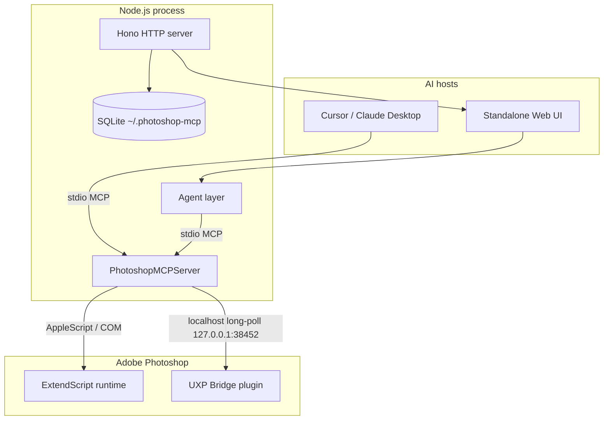

# Architecture

Engineering overview of **Photoshop MCP** — how AI assistants reach Adobe Photoshop reliably across macOS and Windows.

← Back to [README](../README.md)

**Fork maintainer:** [lavalava45](https://github.com/lavalava45)
**Original/upstream project:** [alisaitteke/photoshop-mcp](https://github.com/alisaitteke/photoshop-mcp), created by Ali Sait Teke

---

## System overview

The project is a **local-first bridge** between MCP-capable AI hosts (Cursor, Claude Desktop, or the bundled web UI) and a running Photoshop instance. Nothing runs in the cloud: the MCP server, UI, credentials, and exports all stay on the user's machine.



| Layer | Responsibility | Key paths |
| ----- | -------------- | --------- |
| **MCP core** | Tool/prompt registry, session, MCP protocol | `src/core/` |
| **Platform** | Photoshop detection, script execution | `src/platform/` |
| **Tools** | 129 atomic/non-recipe + 16 recipe (145 total) | `src/tools/` + core connection/Guard tools |
| **Prompt layer** | Server instructions, 21 MCP prompt templates | `src/prompts/` |
| **Errors** | Structured envelopes for agent self-correction | `src/errors/envelope.ts` |
| **Standalone UI** | Hono API, multi-provider agent, chat persistence | `src/ui/`, `web/` |
| **Analytics** | Opt-out anonymous usage (Rybbit) | `src/analytics/` |

---

## MCP server (`src/core/`)

`PhotoshopMCPServer` wires the official MCP SDK with:

- **145 tools** registered via `ToolRegistry` (atomic/non-recipe operations + outcome-oriented recipes + Neural Filters + digital painting/color sampling + method selection + value analysis + measurement/landmarks/guides + VisualMicroPlan orchestration + embedded Guard façade).
- **21 prompts** via `PromptRegistry` (`prompts/list`, `prompts/get`).
- **Server instructions** on `initialize` — workflow contract for host LLMs (state-before-action, prefer recipes, error recovery). See [`src/prompts/instructions.ts`](../src/prompts/instructions.ts).
- **Structured error wrapping** — every tool handler passes through `wrapToolHandler` so failures return JSON with `code` and `suggested_next_tool` for agentic repair loops.
- **Document targeting** — document-bound tool schemas receive optional `document_id` centrally in `src/core/document-target.ts`. The id is kept in async-local request context; ExtendScript execution resolves the exact open document inside the same JSX invocation immediately before the tool script. Non-ExtendScript document mutators can opt into server-side pre-activation; the UXP Neural Filter lane additionally selects the same id inside its `batchPlay` request. Successful pinned results expose `document_target` metadata.

Entry points:

- [`src/index.ts`](../src/index.ts) → ordinary/compatibility stdio transport (`PHOTOSHOP_GUARD_MODE=compatible` unless overridden);
- [`src/cos-plugin.ts`](../src/cos-plugin.ts) → Chat On Steroids guarded stdio entry (`PHOTOSHOP_GUARD_MODE=required` before loading the same server).

---

## Platform abstraction (`src/platform/`)

Photoshop has no general external HTTP automation API. Production semantic routing is now
**UXP-first** through the Photoshop-side companion. Ordinary migrated catalog primitives retain
a bounded ExtendScript/COM implementation that may be selected only when UXP availability is
resolved **before dispatch**; persistence and Neural Filters remain intentional UXP-only
exceptions. The UXP companion provides `batchPlay`/DOM/Imaging capabilities for the migrated
catalog, non-interfering persistence, and the low-latency semantic lane:

| OS | Detection | Execution |
| -- | --------- | --------- |
| **macOS** | Spotlight / app bundle paths (`macos-detector.ts`) | AppleScript → `do javascript` (`macos-executor.ts`) |
| **Windows** | Registry (`windows-detector.ts`) | COM automation (`windows-executor.ts`) |

`connection.ts` manages the legacy external-script lifecycle. New transport migration does
not overload that class. `src/platform/photoshop-backend.ts` defines semantic backend
capabilities and `PhotoshopBackendRouter`, which chooses a backend **before dispatch** for
each migrated primitive. Once dispatch has started, the router never catches a failure and
replays the same operation through another backend; that rule is required before mutating
primitives dispatch and remains mandatory now that P0 mutations are UXP-first.

**Design decision:** production Photoshop dispatch is **UXP-first with bounded pre-dispatch ExtendScript/COM fallback**. `PhotoshopBackendRouter` resolves backend support/readiness before the semantic operation starts. For ordinary migrated tools it may select the retained legacy implementation only before any UXP dispatch; after a UXP command has been dispatched, claimed, become uncertain, or returned an error, the same operation is never replayed through the other backend. `photoshop_save_document` and `photoshop_neural_filter` are intentionally UXP-only/fail-closed, and raw `photoshop_execute_script` remains retired from the production surface. Cloud text/image generation is intentionally not exposed by this fork.

The semantic read lane is UXP-first for `state.read`, `document.info`, `documents.list`,
`selection.bounds`, `layers.list`, `brush.presets.list`, `brush.settings.read`,
`preview.read`, `color.sample`, `colors.sample`, and `history.read`, with legacy ExtendScript selected only **before
dispatch** when UXP is unavailable. These UXP reads use read-only `batchPlay` descriptors rather
than Photoshop DOM reads because live foreground sampling showed DOM state access could activate
Photoshop. `layers.list` additionally reconstructs the ExtendScript recursive layer ordering from
Action Manager indexes and group section markers; brush settings use application
`currentToolOptions` rather than a direct `brush` target because that target can trigger a
modal `Get` error in Photoshop 27.8. Public MCP schema/result shapes remain
unchanged. Preview and color sampling use the UXP Imaging API; `getPixels` is wrapped in a
read-only `executeAsModal` because Photoshop 27.8 requires modal scope for Imaging API reads.

The P0 mutation lane is also UXP-first: brush preset selection, brush settings, foreground
color, layer fill, compound regions, path strokes and ordered dabs use UXP when the companion
is healthy and retain ExtendScript only as a **pre-dispatch** fallback. Fill matches the legacy
`Select Canvas → Fill → Deselect` Photoshop history sequence. Regions construct UXP compound
paths, convert the named path to a selection with Action Manager, fill/deselect, and delete the
temporary path. Strokes/dabs use named UXP paths and retrieve the actual PathItem through
`doc.pathItems.getByName()` before `strokePath`. In Photoshop 27.8, assigning
`app.foregroundColor` inside a painting modal can restore stale opacity/flow; the accepted
implementation re-applies desired size/opacity/flow after each color write.

The 2026-09-23 P1/P2/P3 catalog migration extends this same policy across document lifecycle,
selection/masks, layer transforms/merge, adjustments, filters, text/export, guides/actions,
datasets/image placement, Smart Objects, styles, crop/resize and the remaining migrated catalog
surface. Source migration is complete. The current rebuilt child is live on bridge revision
`compact-v2-20260924-targeting`; the load/revision preflight must be repeated for this source revision before the final
representative post-migration behavior/no-focus-steal trace remains a separate live gate.

Document-bound semantic mutations do not silently activate another tab to satisfy
`document_id`. The explicit `photoshop_set_active_document` tool is the navigation operation;
Guard classifies it as preparation rather than a visual mutation so checkpoint cadence cannot
deadlock a deliberate tab switch.

`photoshop_measure_points` is intentionally not a separate host primitive anymore: it reads
document geometry through `document.info` and calculates normalized coordinates, distances,
and ratios in Node. This keeps Photoshop transport concerns out of pure caller-supplied geometry.

The bridge HTTP server binds only to `127.0.0.1:38452`. In the currently live-tested Photoshop 2026 / UXP runtime, narrowed manifest declarations for that loopback HTTP origin are rejected at runtime with `Manifest entry not found`, including both host-only and host-plus-port forms. The companion manifest therefore currently declares `requiredPermissions.network.domains: "all"` while retaining a loopback-only server listener. This is a runtime compatibility concession, not a request to expose the bridge server beyond localhost.

ExtendScript snippets live in [`src/api/extendscript.ts`](../src/api/extendscript.ts); tools compose them rather than embedding raw strings inline.

---

## Tool model

### Atomic tools (`photoshop_*`)

Fine-grained operations: documents, layers, filters, masks, text, history, state/preview/capabilities. Each successful call returns **context** (active document, layer, selection) so the host LLM stays oriented across turns.

### Recipe tools (`photoshop_recipe_*`)

Multi-step workflows wrapped in a **single Photoshop history state** — one Undo reverts the entire recipe. Examples: `enhance_portrait`, `remove_background`, `prepare_for_web`, `batch_mockup_replace`.

Recipes reduce token burn and failure modes versus chaining many atomic calls without state awareness.

Full prompt-layer mapping: [`docs/prompt-layer.md`](prompt-layer.md).

---

## Standalone web UI

Shipped in the same npm package (`photoshop-mcp-ui` bin). Stack:

| Concern | Choice |
| ------- | ------ |
| Frontend | Vue 3, Tailwind v4, shadcn-vue |
| Backend | Hono on Node (`src/ui/server.ts`) |
| Persistence | better-sqlite3 at `~/.photoshop-mcp/data.db` |
| LLM (API key) | Vercel AI SDK — Anthropic, OpenAI, Google, OpenRouter |
| LLM (CLI account) | Claude Agent SDK / Gemini CLI headless |
| Photoshop | Same MCP server over stdio (`src/ui/agent/mcp-transport.ts`) |

### Agent modes

1. **Default (ReAct)** — model calls tools iteratively; `src/ui/agent/api-key.ts` and provider-specific CLI paths.
2. **Action Plan (beta)** — one planning LLM call produces an ordered tool list; direct execution with bounded repair (`src/ui/agent/action-plan.ts`). Fewer round-trips for multi-step prompts.

The UI restricts the agent to **Photoshop MCP tools only** — no shell, filesystem, or web tools from the host.

---

## Error recovery contract

[`src/errors/envelope.ts`](../src/errors/envelope.ts) classifies ExtendScript/runtime failures into typed codes (`no_active_document`, `version_unsupported`, `generative_unavailable`, …) and suggests the next tool (`photoshop_get_state`, `photoshop_get_capabilities`, etc.).

This is intentional **agent UX design**: hosts can self-correct without guessing, which matters when non-technical users drive Photoshop through natural language.

---

## Repository layout

```
photoshop-mcp/
├── src/
│   ├── core/              # MCP server, registries, session
│   ├── platform/          # macOS / Windows detection & execution
│   ├── api/               # ExtendScript library
│   ├── tools/             # Atomic + recipe MCP tools
│   ├── prompts/           # Instructions + prompt templates
│   ├── errors/            # Structured error envelopes
│   ├── analytics/         # Anonymous usage telemetry
│   └── ui/                # Standalone UI server, agent, providers, store
├── web/                   # Vue SPA (built to web/dist, bundled in npm)
├── docs/                  # Architecture, development, prompt layer, …
├── uxp-plugin/            # Photoshop-side UXP bridge: Neural Filters + fast-lane development
└── scripts/               # Integration tests, spike probes, release tooling
```

---

## Design principles

1. **Local-first** — API keys and OAuth tokens stay on disk; Photoshop runs locally.
2. **State before action** — `photoshop_get_state` / `get_preview` / `get_capabilities` cheapen verification and vision checks. Mutating tools accept optional `document_id` so a Photoshop UI tab switch cannot retarget an edit.
3. **Recipes over atomic chains** — fewer LLM turns, one undo per outcome.
4. **Cross-platform parity** — same tool surface on macOS and Windows; platform quirks isolated in `src/platform/`.
5. **Swappable AI providers** — registry pattern in `src/ui/providers/`; custom OpenAI-compatible endpoints supported.
6. **Observable, not invasive** — analytics are anonymous and opt-out (`ANALYTICS_DISABLED=1`).

---

## Related docs

- [Photoshop Guard architecture](photoshop-guard-architecture.md) — current controller/gateway ownership, host capability requests, and external proxy fallback
- [Prompt layer](prompt-layer.md) — instructions, templates, recipes
- [Available tools](available-tools.md) — full `photoshop_*` reference
- [Development](development.md) — build, test, from-source setup
- [Troubleshooting](troubleshooting.md) — connection and scripting issues

---

## Fork and upstream attribution

This repository is the independent digital-painting fork maintained at
[lavalava45/photoshop-mcp-digital-painting](https://github.com/lavalava45/photoshop-mcp-digital-painting).
It is based on the original
[alisaitteke/photoshop-mcp](https://github.com/alisaitteke/photoshop-mcp) project by Ali Sait Teke.
The upstream website, npm package, registry identity, and author branding are not distribution or ownership claims for this fork.
