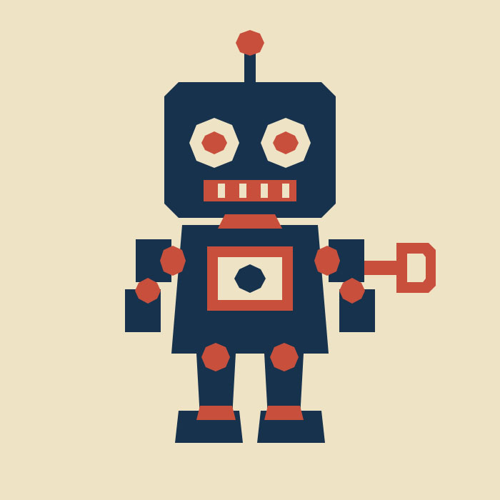

# GuardBot

**GuardBot** is the project mascot for Photoshop MCP — Digital Painting Edition.

He was not designed first and assigned a role later. The image came directly out of a real pipeline validation run on 2026-09-17.

## Origin

After the project added recognition-first construction, broad region painting, DPI-stable canvas coordinates, deterministic layer placement, and executable protected-layer targeting, the next required step in the development roadmap was a fresh holdout painting run on a subject that had not been used to shape those features.

The chosen holdout was a wind-up toy robot in a limited cream, navy, and rust-red screenprint palette.

The first visual pass used a Recognition Block-In with six discriminative cues:

- box-shaped head with antenna;
- paired round lamp eyes;
- horizontal grille mouth;
- rectangular torso with chest panel;
- side wind-up key;
- segmented arms and legs with block feet.

The robot became recognizable on the first meaningful visual pass. The controller recorded first visible change, first subject recognition, and first subject-plus-style recognition at 10.8 seconds.

The second pass improved the limb connections while the established face, chest panel, and wind-up key were placed on a protected layer. That correction completed without any recorded recognition-feature loss.

The accepted holdout frame was then saved as the layered benchmark checkpoint for the run.

## Why he became the mascot

GuardBot ended up representing the architecture unusually well:

- the whole subject is established before detail polishing;
- the important identifying features appear together rather than one at a time;
- stable layer IDs let later work target the intended structure explicitly;
- achieved features can be declared protected and fail closed before an invalid mutation is dispatched;
- every semantic visual mutation is followed by a mandatory preview and visual verdict;
- the final image was produced by the same Photoshop MCP painting path that the repository is built to test and improve.

The name **GuardBot** refers to those protection and verification rules, not to a separate product or upstream feature.

## Asset

The repository copy is:

`assets/mascot/guardbot.jpg`

The image is original output from this fork's own Photoshop painting pipeline. It is not an upstream Photoshop MCP asset and is not Adobe branding.

## Status

GuardBot is the informal visual mascot of this community-maintained fork. He may be reused in repository documentation, release notes, social preview artwork, or other project-owned presentation material, provided the independent-fork and Adobe non-affiliation notices remain clear where relevant.
